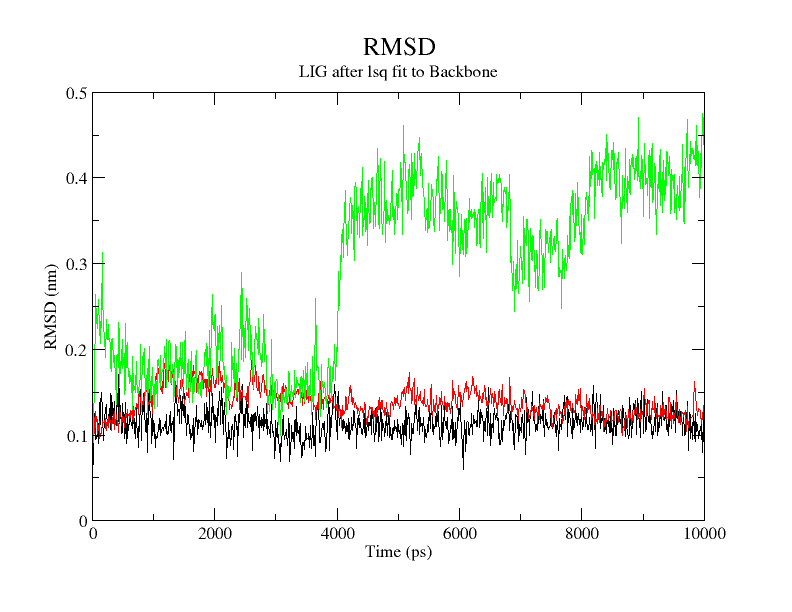
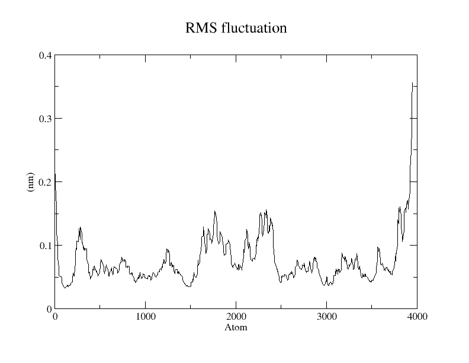
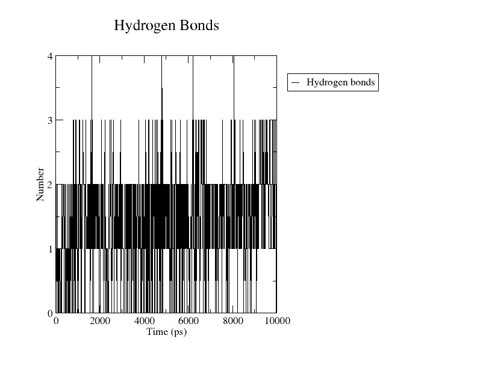
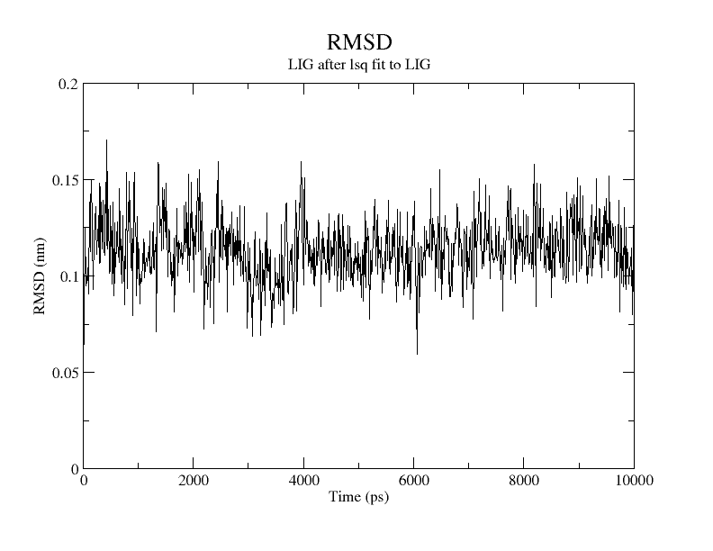
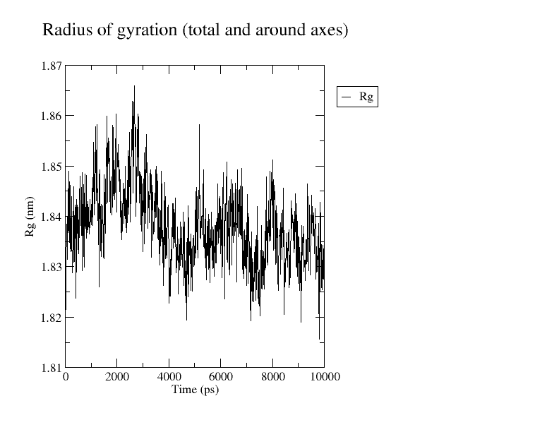
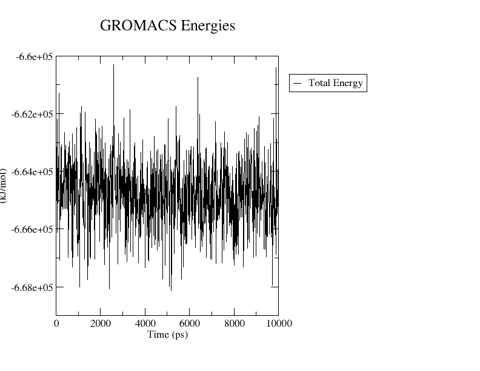

# Structure-Based Identification of Phytochemical Inhibitors Targeting PfPGM1

### Computational identification and evaluation of potential phytochemical inhibitors of *Plasmodium falciparum* phosphoglycerate mutase (PfPGM1)

## Overview

This project presents an **in silico drug-discovery study** aimed at identifying potential phytochemical inhibitors targeting phosphoglycerate mutase 1 (PfPGM1) from *Plasmodium falciparum*.

The study combines **active-site identification, molecular docking, drug-likeness and ADME evaluation, and molecular dynamics simulation** to investigate phytochemical compounds as potential PfPGM1 inhibitors.

---

   ## Research Workflow

**1. Target Protein**  
PfPGM1 (PDB: 1XQ9)

↓

**2. Protein Preparation**

↓

**3. BLASTp-based Reference Identification**

↓

**4. Active-Site Prediction**  
SiteMap + Structural Alignment

↓

**5. Phytochemical Library**  
58 compounds

↓

**6. Molecular Docking**  
AutoDock Vina

↓

**7. Top 10 Docking Hits**

↓

**8. SwissADME Analysis**

↓

**9. Lead Selection**  
AD53 (Tectograndone)

↓

**10. Molecular Dynamics Simulation**  
10 ns using GROMACS

↓

**11. Trajectory Analysis**  
RMSD • RMSF • H-bonds • Radius of Gyration • Energy    

---

## Target Protein

**Protein:** Phosphoglycerate mutase 1 (PfPGM1)  
**Organism:** *Plasmodium falciparum*  
**PDB ID:** 1XQ9  
**Structure:** X-ray crystallographic structure  
**Resolution:** 2.58 Å  
**Oligomeric state:** Homotetramer

PfPGM1 was selected as the target protein because of its role in the glycolytic pathway of *Plasmodium falciparum*. The protein structure used in this study was obtained from the RCSB Protein Data Bank.

### Reference Protein Selection

Because experimentally characterized active-site information was not available for 1XQ9, BLASTp was used to identify a suitable reference protein.

| PDB ID | Sequence Identity | Selection |
|---|---:|---|
| 3KKK | 99% | Not selected |
| 4ODI | 75% | **Selected** |

Although 3KKK showed higher sequence identity, 4ODI was selected because published active-site information was available for this structure. The active-site information from 4ODI was subsequently mapped onto 1XQ9 using structural alignment.

---

## Active-Site Identification

The probable active site of PfPGM1 was identified by combining **BLASTp-based reference selection, structural alignment, and binding-pocket prediction**.

### SiteMap Prediction

Schrödinger SiteMap was used to identify potential ligand-binding pockets in PfPGM1.

The best-ranked pocket was:

- **Site:** `sitemap_2_site_1`
- **Site Score:** 1.07
- **Dscore:** 0.902

This pocket was selected for further analysis.

### Structural Alignment

The active-site residues reported for the reference protein 4ODI were mapped onto PfPGM1 (1XQ9) using **UCSF Chimera**.

The final probable active-site residues identified in 1XQ9 were:

`Arg18, His19, Asn25, Thr31, Tyr100, His192, Asn194`

These residues were used to define the binding region for subsequent molecular docking.

### Tools Used

- **Schrödinger SiteMap** — binding-pocket prediction
- **UCSF Chimera** — structural alignment and residue mapping
- **PyMOL** — protein structure visualization

---

## Molecular Docking

Molecular docking was performed to evaluate the binding of the phytochemical library against the predicted active site of PfPGM1.

### Ligand Preparation

A library of **58 phytochemical compounds** was prepared for docking.

The compounds were converted to **PDBQT format** using AutoDock Tools and prepared for docking against the PfPGM1 receptor.

### Docking Method

**Software:** AutoDock Vina  
**Number of compounds:** 58  
**Selected hits:** Top 10 compounds  
**Visualization:** PyMOL

Each compound was docked against the predicted binding region of PfPGM1 and ranked according to its predicted binding affinity.

### Top Docking Hits

| Rank | Compound | Name | Docking Score (kcal/mol) |
|---:|---|---|---:|
| 1 | **AD53** | **Tectograndone** | **−10.68** |
| 2 | AD32 | Scutianthraquinone D | −10.12 |
| 3 | AD54 | Acetyltectograndone | −10.01 |
| 4 | AD49 | Microcarpine | −9.542 |
| 5 | AD27 | Aloin | −9.371 |
| 6 | AD31 | Scutianthraquinone C | −9.277 |
| 7 | AD43 | Chryslandicin | −9.137 |
| 8 | AD39 | Joziknipholones A | −8.924 |
| 9 | AD7 | Daunorubicin | −8.763 |
| 10 | AD5 | Doxorubicin | −8.629 |

### Best Docking Candidate

**AD53 (Tectograndone)** showed the strongest predicted binding affinity:

> **−10.68 kcal/mol**

The reported interactions of AD53 included:

- SER-22
- GLU-97
- TYR-100
- SER-195

**TYR-100** is one of the probable active-site residues identified during the active-site analysis.

The complete docking results, including PyMOL visualizations and hydrogen-bonding information, are available in:

'top-10-docking-hits/docking-results.xlsx'

---

## SwissADME Analysis

The top 10 docking hits were evaluated using **SwissADME** to assess their drug-likeness and predicted pharmacokinetic properties.

The analysis included:

- Molecular weight
- Lipophilicity (LogP)
- Hydrogen-bond donors (HBD)
- Hydrogen-bond acceptors (HBA)
- Topological polar surface area (TPSA)
- Gastrointestinal (GI) absorption
- Lipinski Rule of Five
- Solubility
- PAINS alerts
- Brenk alerts
- Lead-likeness
- Synthetic accessibility

### AD53 (Tectograndone)

AD53 was further considered based on its docking performance and SwissADME profile.

| Property | AD53 |
|---|---|
| Molecular weight | Below 500 Da |
| GI absorption | High |
| Lipinski violations | 0 |
| TPSA | 119 Ų |
| Synthetic accessibility | 3.74 |

AD53 showed **high GI absorption and zero Lipinski violations**, along with a TPSA of 119 Ų and a synthetic accessibility score of 3.74.

Based on the combined docking and SwissADME results, AD53 was selected as the compound for further molecular dynamics analysis.

The complete SwissADME results are available in:

'swissADME/SwissAdme.xlsx'

---

## Molecular Dynamics Simulation

A **10 ns molecular dynamics (MD) simulation** was performed for the **AD53–PfPGM1 complex** using **GROMACS**.

The simulation was used to evaluate the structural stability of the protein–ligand complex over time.

### MD Analysis

The trajectory was analysed using:

- **RMSD** — structural deviation
- **RMSF** — residue-level flexibility
- **Hydrogen-bond analysis** — protein–ligand interactions
- **Radius of gyration (Rg)** — overall protein compactness
- **Total energy** — energetic stability
- **Ligand-pose comparison** — comparison between the initial and final ligand poses

### RMSD

The PfPGM1 protein backbone RMSD remained approximately **0.12–0.15 nm** during the simulation.

The ligand RMSD remained approximately **0.10–0.13 nm**.

The complex showed an increase in RMSD around **4000 ps**, followed by stabilization, indicating a conformational adjustment during the simulation.

### RMSF

The RMSF analysis showed relatively low fluctuations across most regions of the protein, with higher fluctuations observed in some regions.

### Hydrogen-Bond Analysis

At the beginning of the simulation (0 ns), four hydrogen-bond interactions were reported:

- SER-22
- GLU-97
- TYR-100
- SER-195

At 10 ns, a hydrogen bond involving **THR-31** was reported.

The hydrogen-bonding pattern therefore changed during the simulation.

### Ligand-Pose Comparison

The ligand poses at 0 ns and 10 ns showed near-overlap, with only a small positional shift.

This supported the observation that AD53 remained within the binding region during the simulated trajectory.

### Radius of Gyration

The radius of gyration remained approximately **1.82–1.87 nm**, with most values centred around **1.84 nm**.

No systematic increase or decrease was observed, indicating that the overall compactness of the protein was maintained during the simulation.

### Total System Energy

The total system energy remained within approximately **−6.60 × 10⁵ to −6.68 × 10⁵ kJ/mol** without a progressive drift.

---

## Key Findings

The computational workflow identified **AD53 (Tectograndone)** as the top-ranked compound among the 58 screened phytochemicals.

### Main Findings

- **Target:** PfPGM1 (PDB ID: 1XQ9)
- **Phytochemicals screened:** 58
- **Top docking candidate:** AD53 (Tectograndone)
- **Best docking score:** −10.68 kcal/mol
- **Identified active-site residues:** Arg18, His19, Asn25, Thr31, Tyr100, His192, Asn194
- **AD53 GI absorption:** High
- **AD53 Lipinski violations:** 0
- **AD53 TPSA:** 119 Ų
- **MD simulation:** 10 ns
- **Protein backbone RMSD:** approximately 0.12–0.15 nm
- **Radius of gyration:** approximately 1.82–1.87 nm

Overall, AD53 showed a favourable computational profile across molecular docking, SwissADME analysis, and molecular dynamics simulation.

---

## Limitations

This study was performed entirely using **in silico approaches**.

Molecular docking, ADME prediction, and molecular dynamics simulation provide computational evidence but do not experimentally confirm biological activity.

Experimental studies are therefore required to determine:

- PfPGM1 enzyme inhibition
- Experimental binding affinity
- Selectivity against human PGM
- Antimalarial activity
- Toxicity and pharmacokinetic properties

---

## Future Work

Future studies could include:

- Longer molecular dynamics simulations (100–500 ns)
- Binding free-energy calculations
- In vitro PfPGM1 enzyme-inhibition assays
- Selectivity studies against human PGM
- Structural optimization of AD53
- Further biological and pharmacological evaluation

---

## Conclusion

This project demonstrates a computational workflow for identifying potential phytochemical inhibitors of PfPGM1 using **active-site prediction, molecular docking, SwissADME analysis, and molecular dynamics simulation**.

Among the 58 screened phytochemicals, **AD53 (Tectograndone)** showed the strongest predicted docking affinity and a favourable computational profile. The 10 ns molecular dynamics simulation further provided evidence of the structural behaviour of the AD53–PfPGM1 complex.

AD53 can therefore be considered a **promising computational lead for further investigation**, while experimental validation is required before drawing conclusions about its biological activity.

> **Note:** The results presented in this repository are computational predictions and should not be interpreted as experimental confirmation of PfPGM1 inhibition.
